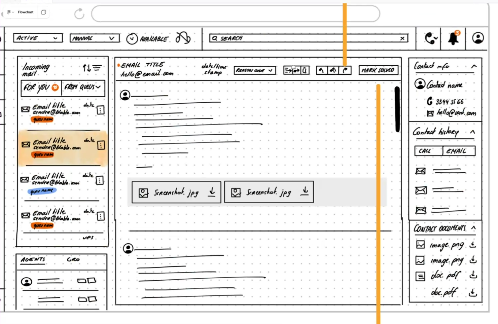
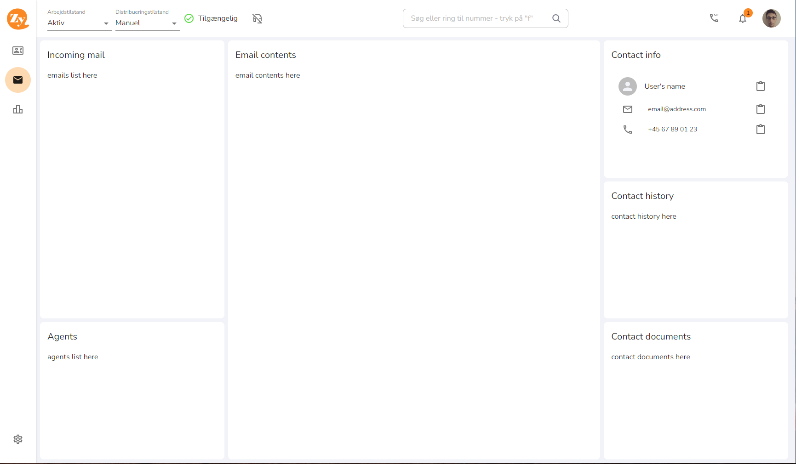

## Assignment 1 - UI/UX

# List the most important questions to clarify the specification (max. 3)

    Q1: How responsive is the GUI?
    Q2: What is the connection between Email and Voice? How are they integrated?
    Q3: Agent can switch between VOICE and Email?  

# Give short constructive feedback to the UX prototype including suggestions for improvements (max. 3)

    Feedback-1: `Agent` and `Contact` section are redundent and can be hidden by default, or kept on top.
    Feedback-2: Attachment visibilities in incoming mail make it more clear, and attachments and consider vedio upload, youtube. etc
    Feedback-3: Instead of showing all email scrollable display, show each eamil one at a time. In that way there can be more speace for email features and attachments

## Assignment 2 - React

Technologies Used
    - `React`: Frontend framework for building the user interface.
    - `TypeScript`: Ensures type safety across the project.
    - `T3 Stack`: Combines Next.js, Prisma, tRPC for full-stack development.
    - `pnpm`: For fast and efficient package management.
    - `Prisma`: ORM for database schema management.
    - `tRPC`: Enables type-safe API communication between frontend and backend.
    - `TailwindCSS`: Utility-first CSS framework for styling.

- Initialize the project using T3 stack: `pnpm create t3-app@latest`

   - Description: The T3 stack includes `Next.js`, `Prisma`, `tRPC`, `TailwindCSS`, and more. 
        This setup would allow to work efficiently on both frontend and backend features.

- Backend Integration:
    - `tRPC` will be used for client-server communication. tRPC simplifies backend integration, allowing type-safe APIs and easy communication between frontend and backend.
    - `Prisma` ORM will be used to handle database interactions for storing emails, contacts, and agents.

    `/src/*`
    ```
        - /Componenets
           - /EmailList
           - /EmailContent
           - /ContactInfo
           - /Agents
        - /hooks
            - useEmails
            - useAgents
        - /pages
            - /api
                - trpc
            - /emails
        - /server
            - /routers
        - /styles
        - /utils
        - /tests
        - /types
        - /stories
    ```

- Approach to Implementing Business Logic:
    - Follow a modular, scalable, and flexible approach to handle future changes and extensions easily, folling are the example that I follow:
        - Establish ATOMIC design
        - Separation of Concerns
        - Use of tRPC for API Communication
        - Hooks and Custom Functions
        - Schema, Database Migrations and Seeding

- Testing:
    * Frontend Testing
        - `jest` 
        - `@testing-library/react` 
        - `@testing-library/jest-dom` 
        - `@testing-library/react-hooks`
        - `ts-jest` 
        - `jest-environment-jsdom`
    
    * Backend Logic Testing
        - For `tRPC` routers, unit tests should verify that the business logic is working as expected. 
            The goal here is to test logic like 
                - `CRUD` operations 
                - Validations
                - `API` behavior without making actual network or database calls


## Assignment 3 - My Resources
    - google
    - chatgpt
    - stackoverflow
    - My own code collection: CSS/HTML Artistery
        - https://github.com/TanvirAlam/my-css 
